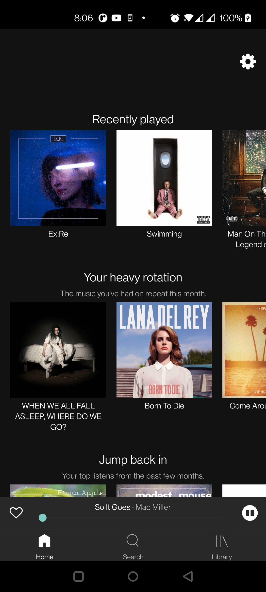
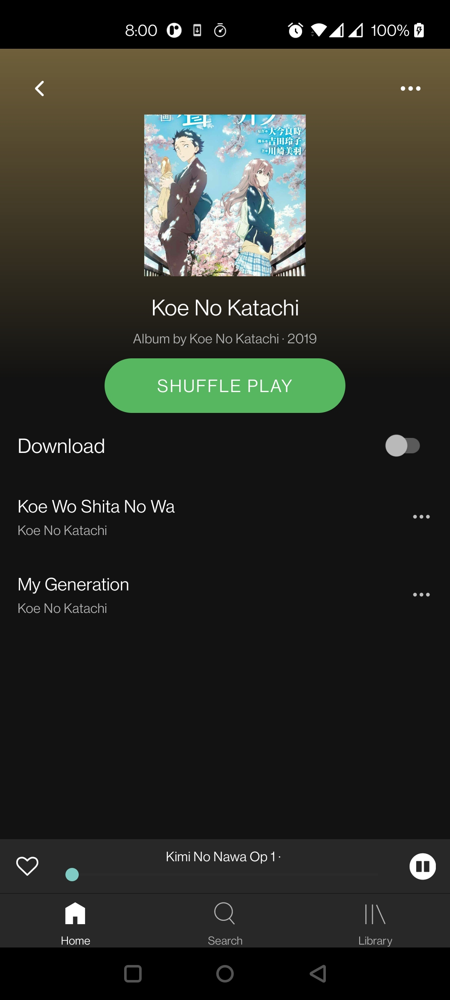
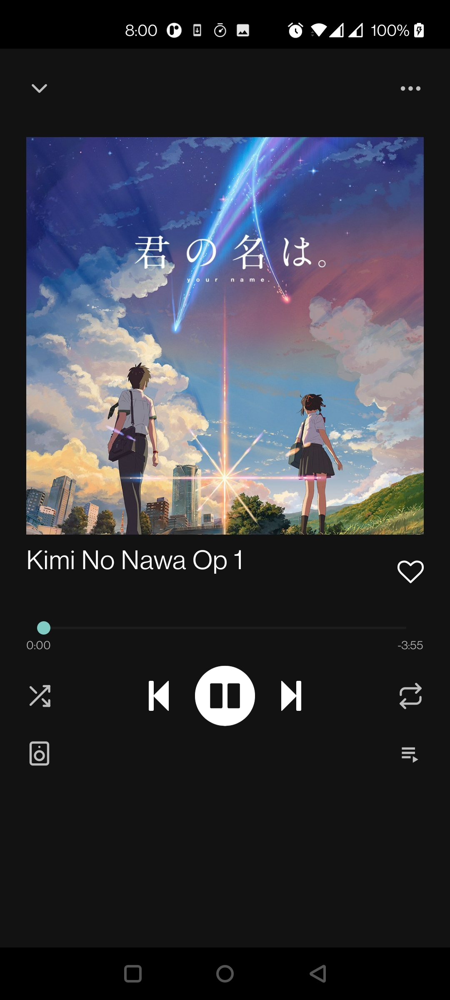

# Spotify Native

A clone of spotify in react native.

[](https://github.com/tterb/atomic-design-ui/blob/master/LICENSEs)

## Screenshots

<p float="left">



</p>
<br />

## Run Locally

Clone the project

```bash
  git clone https://link-to-project
```

Go to the project directory

```bash
  cd spotify-native
```

Install dependencies

```bash
  npm install
```

Start the metro server

```bash
  npm run android/ios
```
